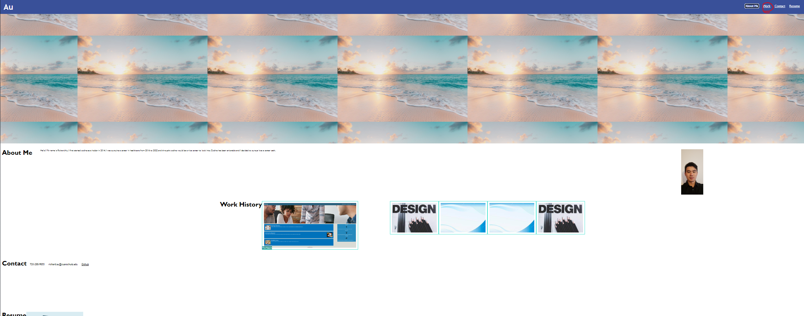
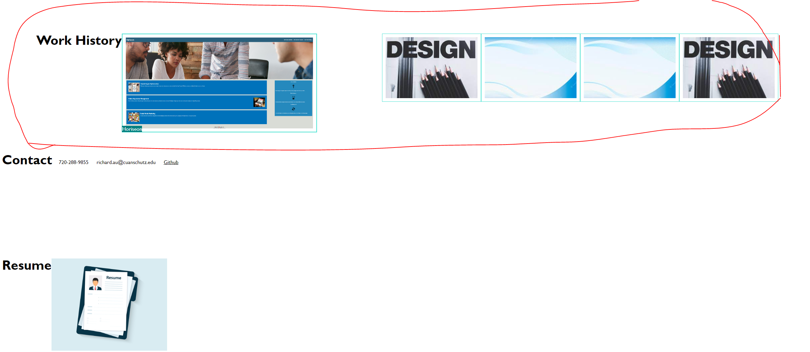

# <Horiseon Homepage>

## Description

Horiseon challenge allowed html and basic css to be implemented into a website to be learned. Fomatting is important to make sure classes, ids, and other elements are called correctly so element's styles are not overriding each other.
This was a stepping stone on how to compact and be concise calling to the same class's styles so and not have repeating code in the css file. 

## Installation

No installation required to use the website.

## Usage

The Website diplays a brief synopsis of who I am, the work I have done that is related to coding, contact info to reach out to me, and my resume. In the header there are four buttons that can be pressed to be sent into a section relating on each button pressed. For example, if Work is pressed then it will send the user down to the Work History Section shown below. 

## Credits

Learning assistants from ASKBCS!

## License

MIT License

Copyright (c) [2023] [Richard Au]

Permission is hereby granted, free of charge, to any person obtaining a copy
of this software and associated documentation files (the "Software"), to deal
in the Software without restriction, including without limitation the rights
to use, copy, modify, merge, publish, distribute, sublicense, and/or sell
copies of the Software, and to permit persons to whom the Software is
furnished to do so, subject to the following conditions:

The above copyright notice and this permission notice shall be included in all
copies or substantial portions of the Software.

THE SOFTWARE IS PROVIDED "AS IS", WITHOUT WARRANTY OF ANY KIND, EXPRESS OR
IMPLIED, INCLUDING BUT NOT LIMITED TO THE WARRANTIES OF MERCHANTABILITY,
FITNESS FOR A PARTICULAR PURPOSE AND NONINFRINGEMENT. IN NO EVENT SHALL THE
AUTHORS OR COPYRIGHT HOLDERS BE LIABLE FOR ANY CLAIM, DAMAGES OR OTHER
LIABILITY, WHETHER IN AN ACTION OF CONTRACT, TORT OR OTHERWISE, ARISING FROM,
OUT OF OR IN CONNECTION WITH THE SOFTWARE OR THE USE OR OTHER DEALINGS IN THE
SOFTWARE.

